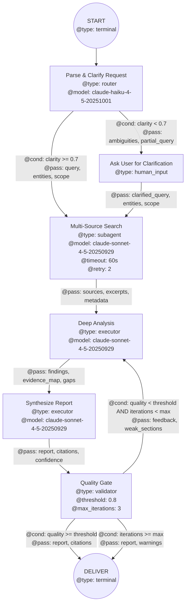

# Research Agent — Execution Graph

```mermaid
graph TD
    start(("START
    @type: terminal"))

    intake["Parse & Clarify Request
    @type: router
    @model: claude-haiku-4-5-20251001"]

    search["Multi-Source Search
    @type: subagent
    @model: claude-sonnet-4-5-20250929
    @timeout: 60s
    @retry: 2"]

    analyze["Deep Analysis
    @type: executor
    @model: claude-sonnet-4-5-20250929"]

    synthesize["Synthesize Report
    @type: executor
    @model: claude-sonnet-4-5-20250929"]

    review["Quality Gate
    @type: validator
    @threshold: 0.8
    @max_iterations: 3"]

    deliver(("DELIVER
    @type: terminal"))

    clarify["Ask User for Clarification
    @type: human_input"]

    start --> intake

    intake -->|"@cond: clarity >= 0.7
               @pass: query, entities, scope"| search
    intake -->|"@cond: clarity < 0.7
               @pass: ambiguities, partial_query"| clarify

    clarify -->|"@pass: clarified_query, entities, scope"| search

    search -->|"@pass: sources, excerpts, metadata"| analyze

    analyze -->|"@pass: findings, evidence_map, gaps"| synthesize

    synthesize -->|"@pass: report, citations, confidence"| review

    review -->|"@cond: quality >= threshold
               @pass: report, citations"| deliver
    review -->|"@cond: quality < threshold AND iterations < max
               @pass: feedback, weak_sections"| analyze
    review -->|"@cond: iterations >= max
               @pass: report, warnings"| deliver
```
