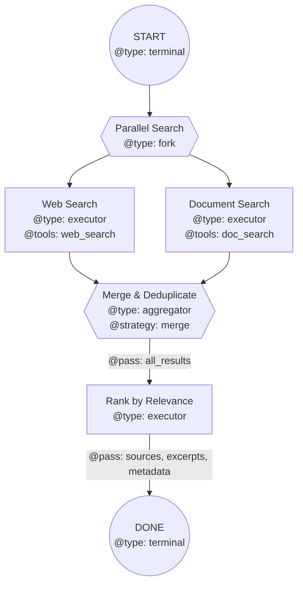

# Multi-Source Search — Sub-Agent Graph

```mermaid
graph TD
    start(("START
    @type: terminal"))

    web_search["Web Search
    @type: executor
    @tools: web_search"]

    doc_search["Document Search
    @type: executor
    @tools: doc_search"]

    fork{{"Parallel Search
    @type: fork"}}

    merge{{"Merge & Deduplicate
    @type: aggregator
    @strategy: merge"}}

    rank["Rank by Relevance
    @type: executor"]

    done(("DONE
    @type: terminal"))

    start --> fork
    fork --> web_search & doc_search
    web_search & doc_search --> merge

    merge -->|"@pass: all_results"| rank
    rank -->|"@pass: sources, excerpts, metadata"| done
```
