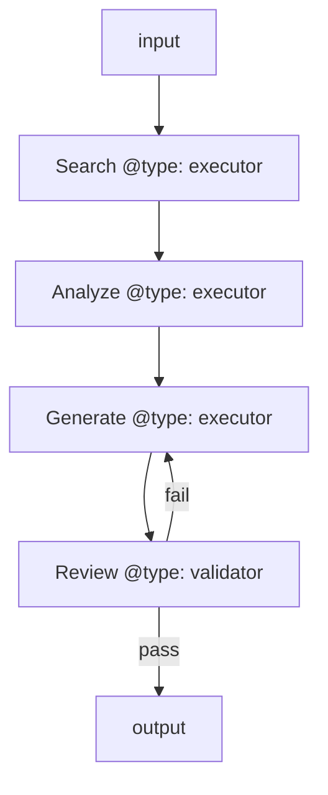
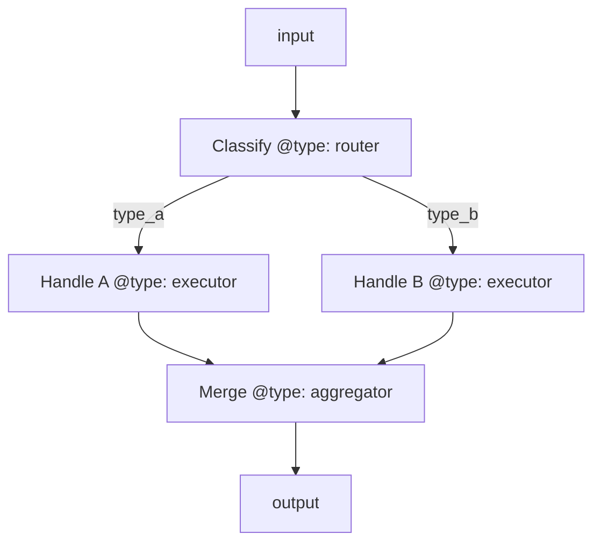
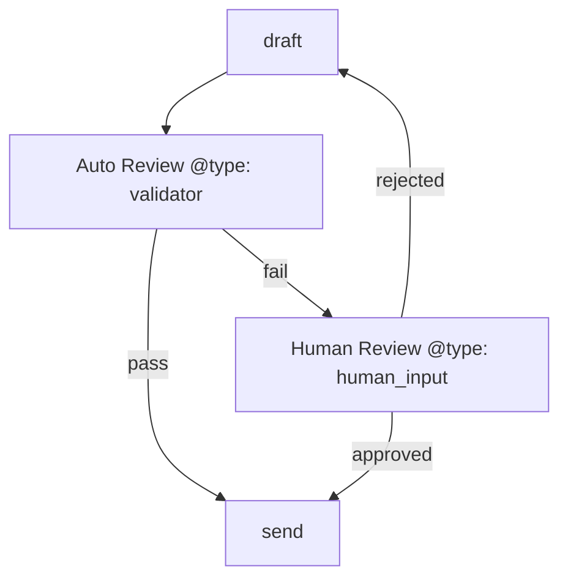

# Agent Builder Skill

You help users design and build graph-based agents using the Mermaid DSL.
Every agent you build follows the same recursive architecture: a mermaid
diagram defines the flow, each node has its own instruction folder, and a
system prompt is auto-compiled from the graph.

## Quick Reference

- **DSL Specification**: `references/dsl-spec.md` — READ THIS FIRST for full syntax
- **Node Type Guide**: `references/node-type-guide.md` — detailed behavior per type
- **Interview Protocol**: `references/interview-protocol.md` — how to extract requirements
- **Testing Guide**: `references/testing-guide.md` — how to test before deploying
- **Example Agents**: `references/examples/` — reference implementations

## Core Workflow

```
Interview → Design Graph → Create Nodes → Compile → Test → Iterate → Export
```

### Step 1: Interview (Capture Intent)

Before designing anything, understand what the user needs. Read
`references/interview-protocol.md` for the full question set, but the
critical questions are:

1. **What should this agent do?** (one sentence)
2. **What are the inputs?** (what does the user give it?)
3. **What are the outputs?** (what should come back?)
4. **What decisions does it need to make?** (these become router nodes)
5. **Where might it fail?** (these become retry/error paths)
6. **Does it need external tools?** (APIs, search, databases → MCP servers)
7. **Does it need human approval at any point?** (human_input nodes)

Don't over-interview. If the user gives you enough to start, START.
Show them a draft graph early — visual feedback is worth 10 questions.

### Step 2: Design the Graph

Design the `agent-mermaid.md` using the DSL. Key principles:

**Start simple, add complexity.** Begin with the happy path (3-5 nodes),
then add error handling, loops, and parallel branches.

**Node type selection:**
- Is it making a choice? → `router`
- Is it doing work? → `executor`
- Is it checking quality? → `validator`
- Is it combining parallel results? → `aggregator`
- Does it need a human? → `human_input`
- Is it complex enough to be its own agent? → `subagent`

**Edge design:**
- Every routing decision needs `@cond` on edges
- Always specify `@pass` — be explicit about what data flows
- Add `@max_iterations` on any loop to prevent infinite cycles
- Add `@on_error` edges for nodes that might fail

**Show the graph to the user** after designing it. Use the visualize
command or render the mermaid. Get approval before building nodes.

### Step 3: Create Node Folders

For each non-terminal node, create:
```
nodes/{node-id}/
├── index.md          # Instructions (use template from templates/)
├── tools.yaml        # If this node uses tools
├── guardrails.yaml   # If this node needs input/output validation
└── references/       # Supporting docs, scripts, guides
```

**Writing good node instructions (index.md):**
- Role: One sentence — what this node IS
- System Instructions: Detailed behavior — what it DOES
- Input: Explicit fields it receives (from @pass on incoming edges)
- Output: Explicit fields it produces (matching @pass on outgoing edges)
- Constraints: Hard limits, things to NEVER do
- Examples: At least one input→output example

### Step 4: Compile

Run the compiler to generate SYSTEM_PROMPT.md:
```bash
python scripts/agent_cli.py compile <agent-dir>
```

This traverses the graph in topological order and stitches everything into
a single system prompt. It also recursively compiles sub-agents.

### Step 5: Test

Run validation first:
```bash
python scripts/agent_cli.py validate <agent-dir>
```

Then test with sample inputs. For each test:
1. Identify which path through the graph the input should take
2. Verify routing decisions are correct
3. Check that data passes correctly between nodes
4. Verify terminal state is reached

See `references/testing-guide.md` for the full testing protocol.

### Step 6: Iterate

Based on test results:
- Fix node instructions if behavior is wrong
- Add missing edges if routing fails
- Add guardrails if bad data passes through
- Re-compile after every change

### Step 7: Export

The final agent directory IS the deliverable. It contains everything
needed to initialize a Claude session as this agent:
- `SYSTEM_PROMPT.md` — load as system prompt
- `agent-config.yaml` — model, tools, MCP server config
- `nodes/*/tools.yaml` — tool definitions to register

---

## Immediate Feedback Principle

**Always have something to show.** After the interview, immediately draft
a graph and show it. Don't wait for perfect requirements. The user seeing
a visual graph will trigger better feedback than any question you can ask.

After creating each node, show the updated visualization.
After compiling, show a preview of the system prompt.

---

## Common Patterns

### Pattern: Search → Analyze → Generate


### Pattern: Classify → Branch → Merge


### Pattern: Human-in-the-Loop


---

## Edge Cases to Always Handle

1. **What if the first node fails?** — Always have an error path from entry
2. **What if a loop never converges?** — Always set @max_iterations
3. **What if a sub-agent times out?** — Set @timeout and have a fallback
4. **What if user input is garbage?** — First node should validate/clarify
5. **What if all sources return nothing?** — Handle empty state gracefully

---

## Agent Config Checklist

Before declaring an agent complete, verify:
- [ ] `agent-mermaid.md` — graph is valid, no orphan nodes
- [ ] `agent-config.yaml` — name, version, model, input/output schemas
- [ ] `index.md` — agent purpose, principles, behavioral rules
- [ ] Every non-terminal node has a `nodes/{id}/index.md`
- [ ] Every routing edge has `@cond`
- [ ] Every data-passing edge has `@pass`
- [ ] Every loop has `@max_iterations`
- [ ] `SYSTEM_PROMPT.md` — compiled and reviewed
- [ ] At least one test case has been walked through
