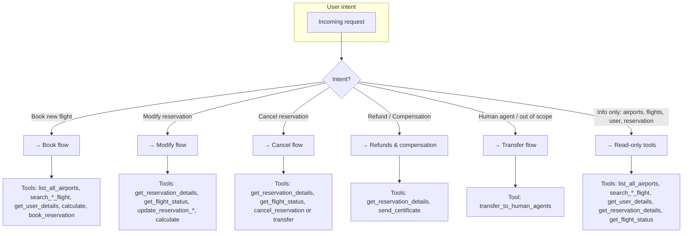
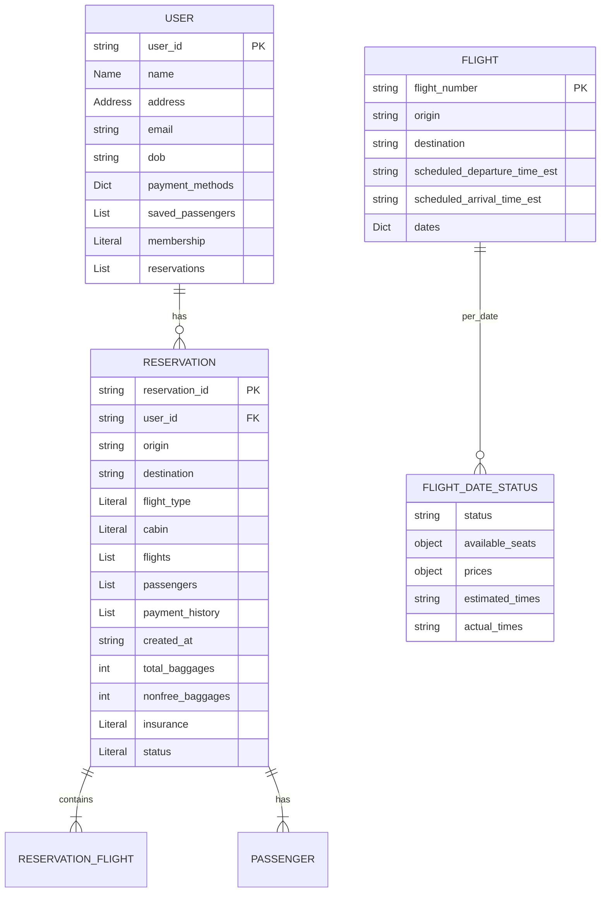
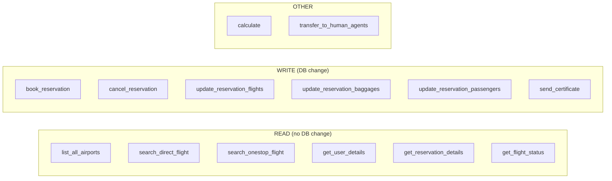
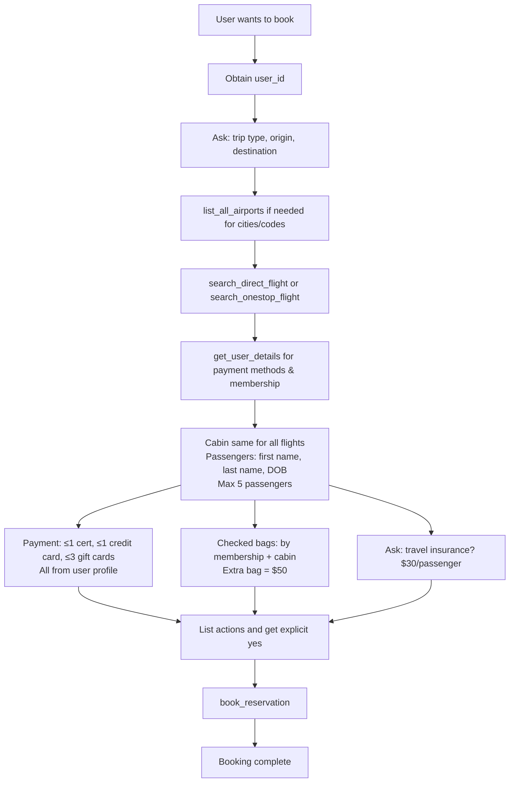
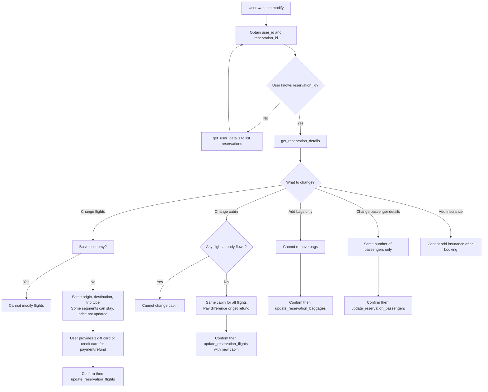
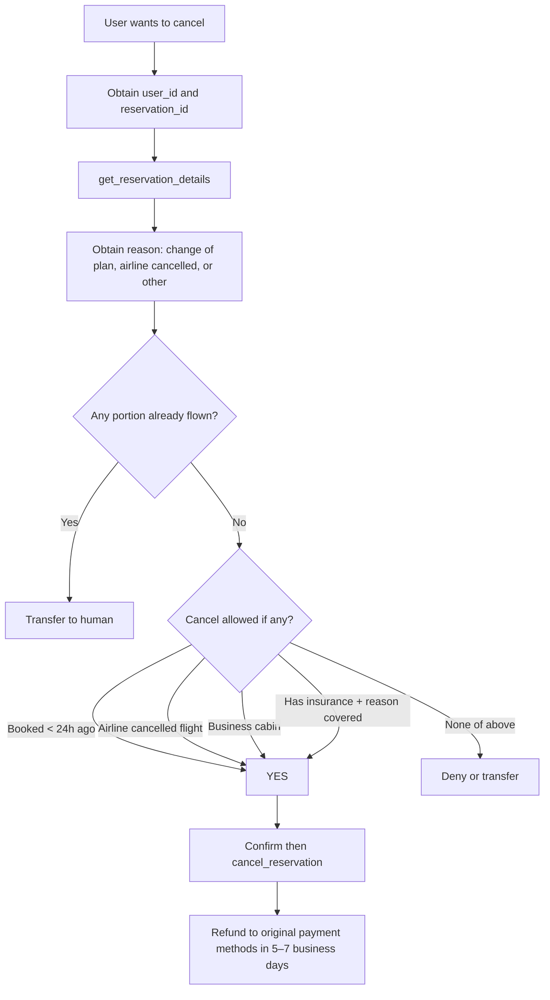
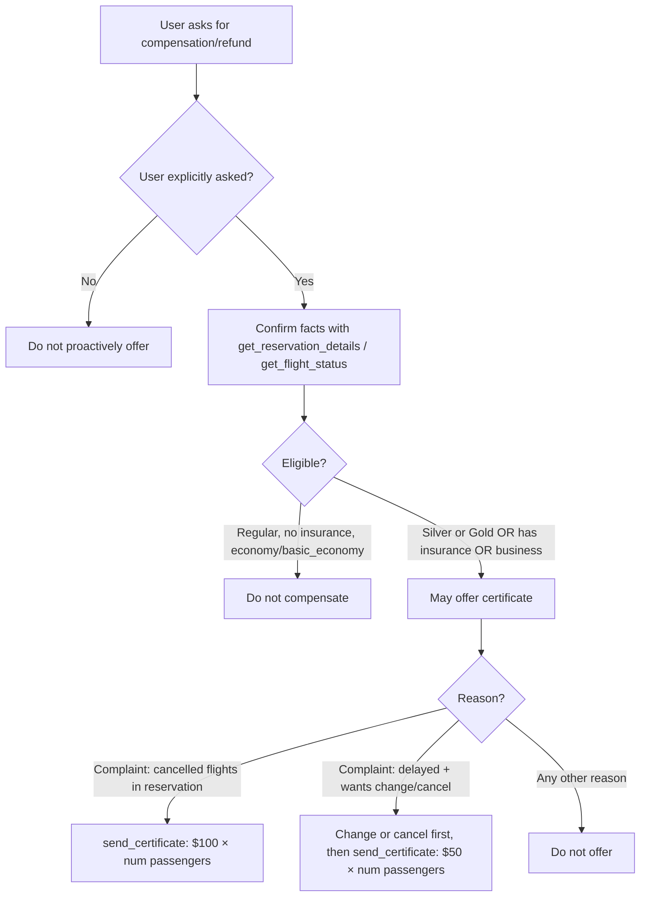
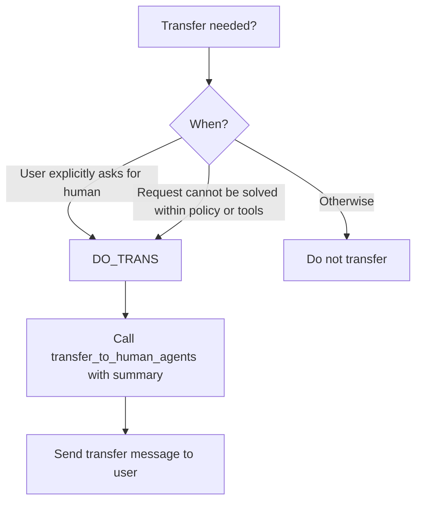
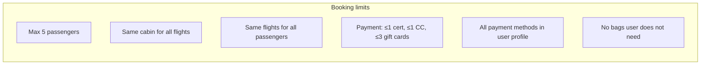

# Airline Domain — Policy, Flows & Tool Guide (Mermaid)

Reference time: **2024-05-15 15:00:00 EST**.

This document summarizes the airline agent policy, decision logic, and **which tool to use when**. It is derived from `policy.md`, `data_model.py`, `environment.py`, and `tools.py`.

---

## 1. High-level intent routing

**Golden rules (all flows):**
- One tool call at a time; no tool call and free-text reply in the same turn.
- Before any **write** that updates the booking DB (book, modify, baggage, cabin, passenger info): list action details and get **explicit user confirmation (yes)**.
- Deny requests that violate policy. Transfer only when the request cannot be handled within scope.

---

## 2. Domain entities (data model summary)

- **Cabin:** `basic_economy` is distinct from `economy`.
- **Payment:** At most 1 travel certificate, 1 credit card, up to 3 gift cards per reservation; all must be in user profile.
- **Flight status (per date):** Only `available` is bookable; `on time` / `delayed` / `flying` are not.

---

## 3. Tool inventory and when to use each

| Tool | When to use |
|------|-------------|
| **list_all_airports** | User asks for airports / city ↔ IATA (e.g. JFK, SFO). |
| **search_direct_flight** | Need direct options for origin, destination, date. |
| **search_onestop_flight** | Need one-stop options for origin, destination, date. |
| **get_user_details** | Need user_id, profile, payment methods, membership, reservations (e.g. to book or find reservation_id). |
| **get_reservation_details** | Need full reservation (flights, cabin, passengers, baggage, insurance, status) for modify/cancel/compensation. |
| **get_flight_status** | Check if a flight is available / delayed / flying / landed / cancelled (for modify/cancel/compensation rules). |
| **calculate** | Any arithmetic (baggage fee, insurance, price difference, compensation amount). |
| **book_reservation** | User confirmed booking: user_id, origin, destination, flight_type, cabin, flights, passengers, payment_methods, total_baggages, nonfree_baggages, insurance. |
| **cancel_reservation** | User confirmed cancellation and policy allows it (see Cancel flow). |
| **update_reservation_flights** | Change flights and/or cabin (same origin, destination, trip type; not basic economy for flight change). Need reservation_id, cabin, full flights list, payment_id for delta. |
| **update_reservation_baggages** | Add bags only (cannot remove). Need reservation_id, total_baggages, nonfree_baggages, payment_id. |
| **update_reservation_passengers** | Change passenger details only; **number of passengers must not change**. |
| **send_certificate** | After confirming facts and policy: offer compensation certificate ($100 or $50 × passengers) when allowed. |
| **transfer_to_human_agents** | Only when user explicitly asks for human or request cannot be fulfilled within policy; then send: "YOU ARE BEING TRANSFERRED TO A HUMAN AGENT. PLEASE HOLD ON." |

---

## 4. Book flow

**When to use which tool in Book:**
- **list_all_airports** — When you need to map city names to IATA codes (or vice versa).
- **search_direct_flight(origin, destination, date)** — When user wants direct flights only.
- **search_onestop_flight(origin, destination, date)** — When user is fine with one stop.
- **get_user_details(user_id)** — To get payment methods, membership (for bag allowance), and to validate payment IDs.
- **calculate(expression)** — For total price, baggage fee (50 × nonfree_baggages), insurance (30 × passengers).
- **book_reservation(...)** — Only after collecting all required fields and **explicit user confirmation**.

---

## 5. Modify flow

**When to use which tool in Modify:**
- **get_reservation_details(reservation_id)** — First for any modify; also to check cabin, flights, passengers, baggage, insurance.
- **get_flight_status(flight_number, date)** — To see if any segment is already flown (for cabin change) or for general status.
- **get_user_details(user_id)** — To list reservations if user doesn’t know reservation_id; or to validate payment_id for updates.
- **update_reservation_flights(reservation_id, cabin, flights, payment_id)** — For changing flights and/or cabin (full new flight list; certificate not allowed for update).
- **update_reservation_baggages(reservation_id, total_baggages, nonfree_baggages, payment_id)** — Only to add bags.
- **update_reservation_passengers(reservation_id, passengers)** — When editing names/DOB only; passenger count must match.
- **calculate** — For price deltas, baggage fees.

---

## 6. Cancel flow

**When to use which tool in Cancel:**
- **get_reservation_details(reservation_id)** — To check created_at (24h), cabin, insurance, flights.
- **get_flight_status(flight_number, date)** — For each segment to see if any is flown (if any flown → transfer, do not cancel).
- **cancel_reservation(reservation_id)** — Only when rules are met and user has confirmed (API does not enforce rules; agent must).

---

## 7. Refunds and compensation flow

**When to use which tool:**
- **get_reservation_details** — To confirm membership, insurance, cabin, passengers, status.
- **get_flight_status** — To confirm cancelled/delayed and which segments.
- **send_certificate(user_id, amount)** — Only after confirming facts and eligibility; amount = 100 × or 50 × number of passengers as per policy.

---

## 8. Transfer flow

**When to use:** **transfer_to_human_agents(summary)** only in the two cases above; then send the exact message.

---

## 9. Booking constraints (quick reference)

**Free checked bags (by booking user membership):**

| Membership | basic_economy | economy | business |
|------------|--------------|---------|----------|
| regular    | 0            | 1       | 2        |
| silver     | 1            | 2       | 3        |
| gold       | 2            | 3       | 4        |

Extra bag = **$50**. Travel insurance = **$30 per passenger** (optional at booking only).

---

## 10. File and environment reference

| Asset | Role |
|-------|------|
| **policy.md** | Human-readable agent policy (source of truth for rules). |
| **data_model.py** | User, Flight, Reservation, FlightDateStatus, payment types, etc. |
| **environment.py** | Builds Environment with policy + AirlineTools(db). |
| **tools.py** | AirlineTools implementation (all tools above). |
| **utils.py** | Paths: AIRLINE_DB_PATH, AIRLINE_POLICY_PATH, AIRLINE_TASK_SET_PATH. |

This Mermaid document is a **companion** to `policy.md` and the code: it encapsulates the same logic and flows and specifies which tool to use in each situation.
