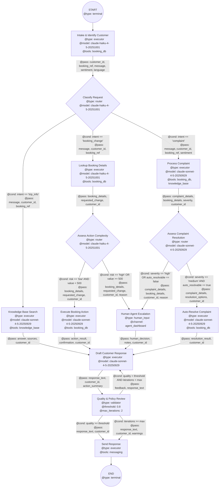

# Travel Support Agent — Execution Graph

```mermaid
graph TD
    start(("START
    @type: terminal"))

    intake["Intake & Identify Customer
    @type: executor
    @model: claude-haiku-4-5-20251001
    @tools: booking_db"]

    classify{"Classify Request
    @type: router
    @model: claude-haiku-4-5-20251001"}

    kb_search["Knowledge Base Search
    @type: executor
    @model: claude-sonnet-4-5-20250929
    @tools: knowledge_base"]

    booking_lookup["Lookup Booking Details
    @type: executor
    @model: claude-haiku-4-5-20251001
    @tools: booking_db"]

    assess_action{"Assess Action Complexity
    @type: router
    @model: claude-haiku-4-5-20251001"}

    handle_action["Execute Booking Action
    @type: executor
    @model: claude-sonnet-4-5-20250929
    @tools: booking_db"]

    escalate("Human Agent Escalation
    @type: human_input
    @channel: agent_dashboard")

    complaint_handler["Process Complaint
    @type: executor
    @model: claude-sonnet-4-5-20250929
    @tools: booking_db, knowledge_base"]

    complaint_assess{"Assess Complaint Resolution
    @type: router
    @model: claude-sonnet-4-5-20250929"}

    resolve_complaint["Auto-Resolve Complaint
    @type: executor
    @model: claude-sonnet-4-5-20250929
    @tools: booking_db"]

    draft_response["Draft Customer Response
    @type: executor
    @model: claude-sonnet-4-5-20250929"]

    review["Quality & Policy Review
    @type: validator
    @threshold: 0.8
    @max_iterations: 2"]

    send_response["Send Response
    @type: executor
    @tools: messaging"]

    done(("END
    @type: terminal"))

    start --> intake

    intake -->|"@pass: customer_id, booking_ref, message, sentiment, language"| classify

    classify -->|"@cond: intent == 'trip_info'
                  @pass: message, customer_id, booking_ref"| kb_search
    classify -->|"@cond: intent == 'booking_change'
                  @pass: message, customer_id, booking_ref"| booking_lookup
    classify -->|"@cond: intent == 'complaint'
                  @pass: message, customer_id, booking_ref, sentiment"| complaint_handler

    kb_search -->|"@pass: answer, sources, customer_id"| draft_response

    booking_lookup -->|"@pass: booking_details, requested_change, customer_id"| assess_action

    assess_action -->|"@cond: risk == 'low' AND value < 500
                       @pass: booking_details, requested_change, customer_id"| handle_action
    assess_action -->|"@cond: risk == 'high' OR value >= 500
                       @pass: booking_details, requested_change, customer_id, reason"| escalate

    handle_action -->|"@pass: action_result, confirmation, customer_id"| draft_response

    escalate -->|"@pass: human_decision, notes, customer_id"| draft_response

    complaint_handler -->|"@pass: complaint_details, booking_details, severity, customer_id"| complaint_assess

    complaint_assess -->|"@cond: severity <= 'medium' AND auto_resolvable == true
                          @pass: complaint_details, resolution_options, customer_id"| resolve_complaint
    complaint_assess -->|"@cond: severity == 'high' OR auto_resolvable == false
                          @pass: complaint_details, booking_details, customer_id, reason"| escalate

    resolve_complaint -->|"@pass: resolution_result, customer_id"| draft_response

    draft_response -->|"@pass: response_text, customer_id, action_summary"| review

    review -->|"@cond: quality >= threshold
                @pass: response_text, customer_id"| send_response
    review -->|"@cond: quality < threshold AND iterations < max
                @pass: feedback, response_text"| draft_response
    review -->|"@cond: iterations >= max
                @pass: response_text, customer_id, warnings"| send_response

    send_response --> done
```
