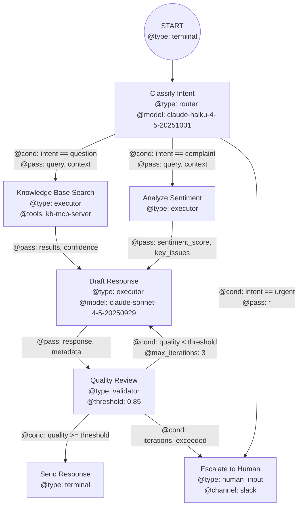

# Agent DSL Specification

## Philosophy

Every agent is a graph. Every node in that graph is itself an agent.
This is turtles all the way down — a fractal architecture where the same
structure repeats at every level of abstraction.

An agent is defined by:
1. **A mermaid diagram** (`agent-mermaid.md`) — the topology of its reasoning
2. **Node folders** — each node is a sub-agent with its own instructions
3. **A generated system prompt** — automatically compiled from the graph + nodes

## Core Principle: Graphs as Agent DNA

A mermaid flowchart isn't just documentation — it IS the agent. The graph
defines control flow, decision points, parallel execution, error handling,
and data routing. The DSL extends standard mermaid with structured metadata
embedded in node labels and edge annotations.

## Why Mermaid?

- Human-readable, version-controllable, diffable
- Existing tooling for rendering
- Simple enough for non-engineers to understand
- Expressive enough to capture complex agent logic
- Claude can both read and write it natively

---

## Directory Structure (Recursive)

```
my-agent/
├── agent-mermaid.md          # The graph definition (the "DNA")
├── agent-config.yaml         # Agent-level config (model, temp, etc.)
├── SYSTEM_PROMPT.md          # AUTO-GENERATED — never edit manually
├── index.md                  # Agent overview, purpose, constraints
│
├── nodes/
│   ├── node-name/
│   │   ├── index.md          # Node instructions, role, behavior
│   │   ├── tools.yaml        # MCP servers, functions, APIs for this node
│   │   ├── guardrails.yaml   # Input/output validation rules
│   │   ├── references/       # Scripts, docs, product guides
│   │   │   ├── api-guide.md
│   │   │   └── helper.py
│   │   │
│   │   ├── agent-mermaid.md  # ← RECURSIVE: this node IS an agent too
│   │   ├── agent-config.yaml
│   │   ├── SYSTEM_PROMPT.md  # Auto-generated for this sub-agent
│   │   ├── index.md
│   │   └── nodes/            # Sub-nodes of this sub-agent
│   │       └── ...
│   │
│   ├── another-node/
│   │   ├── index.md
│   │   └── ...
│   └── ...
│
├── shared/                   # Shared resources across all nodes
│   ├── schemas/              # Data schemas passed between nodes
│   ├── prompts/              # Reusable prompt fragments
│   └── tools/                # Shared tool definitions
│
└── runs/                     # Execution history
    └── ...
```

---

## The Mermaid DSL

### Extended Node Syntax

Nodes use structured labels with metadata encoded in a parseable format:

```
node_id["Display Name
@type: router | executor | validator | aggregator | human_input | terminal
@model: claude-sonnet-4-5-20250929
@retry: 3
@timeout: 30s"]
```

### Node Types

| Type          | Meaning                                          |
|---------------|--------------------------------------------------|
| `executor`    | Does work — calls tools, generates content        |
| `router`      | Makes decisions, routes to different paths        |
| `validator`   | Checks output quality, schema compliance          |
| `aggregator`  | Combines outputs from parallel branches            |
| `human_input` | Pauses for human review/input                     |
| `transformer` | Reshapes data between nodes                       |
| `terminal`    | End state — success, failure, or handoff           |
| `subagent`    | Delegates to a fully recursive sub-agent           |

### Edge Syntax (Conditions & Data)

Edges carry conditions and data routing:

```
A -->|"@cond: sentiment == positive
      @pass: summary, score"| B
```

- `@cond` — condition for traversal (evaluated against the output of source node)
- `@pass` — which fields from source output to pass to target
- `@transform` — inline transformation expression
- `@fallback` — edge taken when condition fails

### Special Constructs

**Parallel Execution (fork/join):**
```
fork{{"Fork: parallel
@type: fork"}}
join{{"Join: aggregate
@type: aggregator
@strategy: merge | vote | first"}}

fork --> A & B & C
A & B & C --> join
```

**Loops:**
```
process --> check{"Quality OK?
@type: router
@max_iterations: 5"}
check -->|"@cond: quality < 0.8"| process
check -->|"@cond: quality >= 0.8"| done
```

**Error Handling:**
```
risky_node --> |"@on_error: true"| error_handler
```

---

## Full Example: Customer Support Agent



---

## agent-config.yaml Schema

```yaml
name: customer-support-agent
version: "1.0.0"
description: "Handles customer support inquiries with KB lookup and sentiment analysis"

defaults:
  model: claude-sonnet-4-5-20250929
  temperature: 0.3
  max_tokens: 4096

execution:
  mode: sequential          # sequential | parallel | adaptive
  max_total_time: 120s
  error_strategy: retry_then_escalate

context:
  shared_memory: true       # nodes can read/write shared state
  pass_history: false       # pass full conversation to each node

mcp_servers:
  - name: kb-server
    url: "https://kb.example.com/mcp"
  - name: slack-server
    url: "https://slack-mcp.example.com/sse"

input_schema:
  type: object
  properties:
    message:
      type: string
    customer_id:
      type: string
    channel:
      type: string
      enum: [email, chat, phone]

output_schema:
  type: object
  properties:
    response:
      type: string
    action_taken:
      type: string
    escalated:
      type: boolean
```

---

## Node index.md Schema

Each node's `index.md` follows this structure:

```markdown
# Node: [Display Name]

## Role
One-line description of what this node does.

## System Instructions
Detailed behavioral instructions for this node when it executes.
This is the "personality" and "expertise" of this node-as-agent.

## Input
What this node expects to receive (from edges or parent).

## Output
What this node produces (passed along edges).

## Constraints
- Hard limits, safety rails, things to never do.

## Examples
### Example 1: [Scenario]
**Input:** ...
**Expected Output:** ...

## References
- See `references/api-guide.md` for API details
- See `references/tone-guide.md` for voice guidelines
```

---

## System Prompt Generation Rules

The `SYSTEM_PROMPT.md` is auto-generated by traversing the graph and
compiling all node instructions into a single coherent prompt. The rules:

1. **Header**: Agent name, version, purpose from `agent-config.yaml` + `index.md`
2. **Graph Overview**: Natural language description of the flow
3. **Node Instructions**: Each node's `index.md` content, ordered by graph topology
4. **Tool Definitions**: Merged from all node `tools.yaml` files
5. **Guardrails**: Merged validation rules
6. **Data Contracts**: Input/output schemas between nodes
7. **Execution Rules**: From config — timeouts, retries, error handling
8. **Sub-agent References**: For `subagent` type nodes, reference to their own SYSTEM_PROMPT.md

The generation follows topological sort order so Claude reads nodes
in the order it will encounter them during execution.
