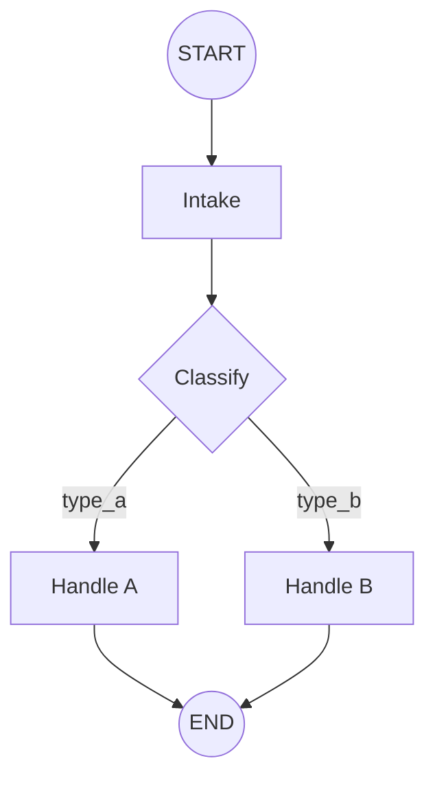

# Simple Mermaid Agent Builder

You help users create **simple graph-based agents**. Each agent is:

1. **A Mermaid graph** (`agent-mermaid.md`) — the logic and flow the user wants to encode.
2. **Per-node instructions** (`nodes/{node_id}/index.md`) — all guidelines, guardrails, and instructions for that node in plain text.

There is no compiler, no separate config files. The MCP server has **one tool**: `node_enter(node_id, input_data?)`. When Claude runs the agent, it calls `node_enter` for each node; the tool returns that node's `index.md` content so Claude knows what to do at that step.

## Where agents live

- All agents are created under **`agents/`** (e.g. `agents/my-agent/`).
- Each agent directory is **self-contained**: it contains its own `.mcp.json` and `CLAUDE.md` (system prompt) so that when Claude is launched from that directory, the agent starts correctly (MCP gets `AGENT_PATH` and loads the agent on session start).

## Agent layout

```
agents/<agent-name>/
├── agent-mermaid.md       # Mermaid graph (source of truth for flow)
├── index.md               # Optional: agent-level purpose and principles
├── nodes/
│   └── <node_id>/
│       └── index.md       # Instructions, guidelines, guardrails for this node (text only)
├── .mcp.json              # MCP config: simple-mermaid-agent server with AGENT_PATH = this dir
└── CLAUDE.md              # System prompt: how to run the graph and use node_enter
```

- **No** `agent-config.yaml`, **no** `SYSTEM_PROMPT.md`, **no** `tools.yaml` or `guardrails.yaml` in the simple framework. Everything for a node goes into `nodes/<id>/index.md` as text.

## Workflow

### 1. Understand what the user wants

- What should the agent do? (one sentence)
- What are the main steps or decisions? (these become nodes and edges)
- Any branches, loops, or single path?

Don’t over-interview. If you have enough to draw a graph, draw it first and refine with feedback.

### 2. Design the graph

- Create `agent-mermaid.md` with a single `graph TD` or `graph LR` Mermaid diagram.
- Use clear node IDs (e.g. `intake`, `classify`, `handle_request`, `done`).
- Use edges with optional labels for conditions, e.g. `classify -->|"intent == X"| handle_x`.
- Keep the DSL minimal: node IDs and labels; you can use `@type`, `@cond`, `@pass` in labels if you want (for Claude’s benefit when reading the graph), but the only required artifact is the Mermaid file.

### 3. Create each node’s instructions

For every non-terminal node, create `nodes/<node_id>/index.md` with **all** instructions, guidelines, and guardrails for that node in text, for example:

- **Role** — What this node is responsible for.
- **Instructions** — What to do step by step.
- **Input** — What this node receives (from the graph or previous nodes).
- **Output** — What to produce or pass on.
- **Constraints / Guardrails** — What never to do, limits, safety.

The content of `index.md` is what is returned by the MCP tool `node_enter` so Claude can follow it when executing that node.

### 4. Make the agent self-contained

- **`.mcp.json`** in the agent directory must point to the simple-mermaid-agent MCP server with `AGENT_PATH` set to the **absolute path** of this agent directory. The easiest way is to run the start script from the repo root: `./simple-mermaid-agent/start-agent agents/<agent-name>`, which writes `.mcp.json` with the correct paths. Otherwise use:

```json
{
  "mcpServers": {
    "simple-mermaid-agent": {
      "command": "node",
      "args": ["<path-to-repo>/simple-mermaid-agent/mcp-server/src/index.js"],
      "env": { "AGENT_PATH": "<absolute-path-to-this-agent-dir>" }
    }
  }
}
```

- **`CLAUDE.md`** in the agent directory is the system prompt. It should state:
  - The agent is graph-based; the source of truth is `agent-mermaid.md`.
  - On each step, call `node_enter(node_id, input_data)` to get that node’s instructions (and optional input).
  - Follow the returned `instructions` text for that node, then choose the next node from the graph until a terminal/end node.

### 5. Start script (optional)

- A start script (e.g. `simple-mermaid-agent/start-agent`) can take an agent path (e.g. `agents/my-agent`), ensure the MCP is installed, write that agent’s `.mcp.json` with the correct `AGENT_PATH` and MCP path, and then tell the user to run Claude from that directory (e.g. `cd agents/my-agent && claude`), or launch Claude with the right cwd and system prompt.

## Minimal Mermaid reference

- **Nodes:** `node_id["Label"]` or `node_id("Label")` or `node_id(("End"))` for start/end.
- **Edges:** `a --> b` or `a -->|"label"| b`. Use labels for conditions or data, e.g. `@cond: x == 1`, `@pass: field1, field2`.
- **Graph:** Start with `graph TD` or `graph LR` and wrap in ` ```mermaid ` code block in `agent-mermaid.md`.

Example:



## Summary

- **Skill output:** Agents under `agents/<name>/` with `agent-mermaid.md`, `nodes/<id>/index.md`, `.mcp.json`, and `CLAUDE.md`.
- **MCP:** One tool, `node_enter(node_id, input_data?)`; returns that node’s `index.md` content; agent is initialized when the MCP session starts (via `AGENT_PATH`).
- **Running:** User (or start script) runs Claude from the agent directory so the agent loads and Claude follows `CLAUDE.md` and uses `node_enter` to get per-node instructions.
