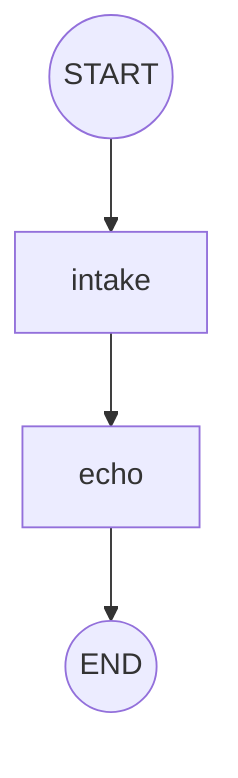

# Simple Echo Agent — Graph

```mermaid
graph TD
    start(("START")) --> intake["intake"]
    intake --> echo["echo"]
    echo --> done(("END"))
```

Flow: intake → echo → end. Node instructions are in nodes/<id>/index.md.
