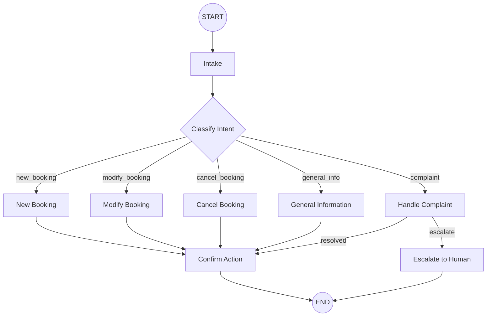

# Travel Support Agent - Workflow Graph

This agent handles customer support inquiries for a travel agency.

## Flow Description

1. **Intake**: Greet customer and gather initial inquiry
2. **Classify**: Determine the type of request (new booking, modification, cancellation, info, or complaint)
3. **Route to appropriate handler**:
   - **New Booking**: Help customer book flights, hotels, packages
   - **Modify Booking**: Change dates, passengers, destinations
   - **Cancel Booking**: Process cancellations and refunds
   - **General Info**: Answer questions about destinations, policies, travel requirements
   - **Handle Complaint**: Address issues, may escalate to human agent
4. **Confirm**: Summarize action taken and confirm with customer
5. **End**: Close the interaction gracefully
